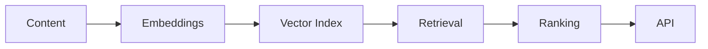

# Discovery Feed Recommender (Embeddings + Vector Search)

A minimal, production-style Python project that simulates a discovery feed using sentence embeddings, FAISS vector search, and a lightweight ranking stage. It demonstrates how modern recommendation systems retrieve candidates and re-rank them before serving results via an API.

## What this project shows

- **Embeddings**: encode article text using `all-MiniLM-L6-v2`.
- **Vector search**: nearest neighbor search with FAISS.
- **Candidate retrieval**: top-20 similar articles for a query.
- **Ranking**: combine similarity, popularity, and recency.
- **API**: FastAPI endpoint for recommendations.

## Pipeline



## Repo structure

```
repo/
  README.md
  pyproject.toml
  requirements.txt
  data/
    articles.csv
  src/
    embeddings.py
    vector_index.py
    retrieval.py
    ranking.py
    recommender.py
    api.py
  notebooks/
    exploration.ipynb
  scripts/
    build_index.py
    run_api.py
  run_server.bat
```

## How it works

### 1) Embedding generation
- `generate_embeddings(texts)` uses `sentence-transformers` to embed article text.
- Model: `all-MiniLM-L6-v2`.

### 2) Vector index
- FAISS index with cosine similarity (via normalized embeddings + inner product).
- The index is saved to disk for fast loading.

### 3) Retrieval
- The query is embedded, then top-20 nearest articles are retrieved.

### 4) Ranking
Ranking combines similarity, popularity, and recency:

$$
score = 0.7 \cdot similarity + 0.2 \cdot popularity + 0.1 \cdot recency
$$

### 5) API
- FastAPI serves `GET /recommend?q=...`.
- Returns the top-10 ranked results by default.

## Quickstart

1) Install dependencies with uv:

```
uv sync
```

2) Build the FAISS index:

```
python scripts/build_index.py
```

3) Run the API:

```
python scripts/run_api.py
```

Or use the Windows helper:

```
run_server.bat
```

4) Try it:

```
http://localhost:8000/recommend?q=deep%20learning
```

## Notes

- The dataset is a small synthetic set of 60 articles across ML, data science, travel, sports, and programming.
- See the notebook for UMAP visualization and interactive examples.

## Design Decisions

- Recency is weighted lowest to avoid over-prioritizing fresh content at the expense of relevance; this keeps the feed stable while still giving new items a modest boost.
